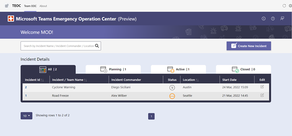

# Microsoft Teams Emergency Operation Center

Microsoft Teams Emergency Operations Center (TEOC) was created after seeing the impact and value that standard and centralized Microsoft Teams creation could make when responding to an incident. This app template is created to help showcase and inspire new ways on how you can leverage the productivity tools of Microsoft 365 to quickly and efficiently respond in times of need.

   